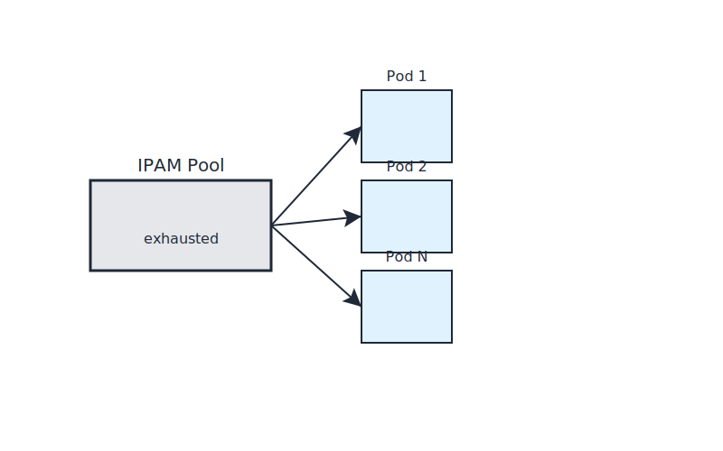

# Lab 01 – IPAM Exhaustion
## City Component
IPAM Exhaustion
## Purpose
This lab focuses on a single networking concept mapped to the city model.
Complete all steps sequentially.

## Visual

# Failure Scenario
Reduce pod CIDR size. Create pods until allocation fails.

# Symptoms
- Pods stuck in Pending
- No network errors in logs

# Root Cause
No available IPs.

# Lesson
IPAM failures look like scheduler problems.
