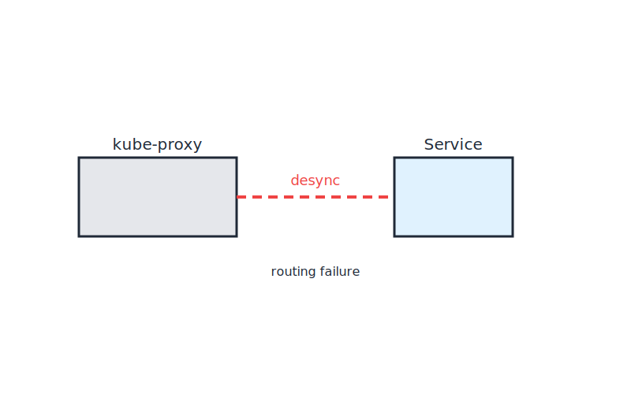

# Lab 04 – Kube-Proxy Desync Failure
## City Component
Kube-Proxy Desynchronization
## Purpose
This lab demonstrates the impact of kube-proxy desynchronization in Kubernetes networking, mapped to the city model.

## Visual

---
## Scenario Description
In this lab, you will simulate a failure where kube-proxy loses synchronization with the cluster state, causing incorrect routing of traffic. In the city analogy, this is like traffic signals or signs being out of sync, leading to misdirected vehicles and confusion.

## Steps
1. Deploy a Kubernetes cluster with multiple nodes.
2. Simulate kube-proxy desynchronization (e.g., by stopping kube-proxy on one node).
3. Attempt to access services from different nodes.
4. Observe routing failures and traffic misdirection.

## Expected Outcome
Traffic will be misrouted or dropped, demonstrating the importance of kube-proxy synchronization for reliable service access.

## Cleanup
Restart kube-proxy or restore cluster state.
