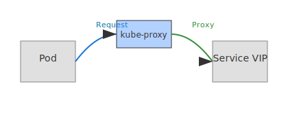

# Lab 07 – Services
## City Component
Services
## Purpose
This lab focuses on a single networking concept mapped to the city model.
Complete all steps sequentially.

## Visual

---
## Scenario Description
In Kubernetes, services provide stable access points to pods, routing traffic based on selectors. This is analogous to a front desk routing visitors to apartments in the city model. This lab guides you through creating a service, testing access, and observing the abstraction.

## Steps
See [steps.md](./steps.md) for detailed instructions.

## Objectives
See [objectives.md](./objectives.md) for learning goals.

## Verification
See [verification.md](./verification.md) for how to confirm the lab outcome.

## Cleanup
See [cleanup.md](./cleanup.md) for environment restoration.
