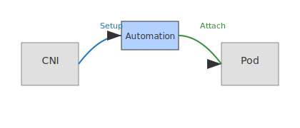

# Lab 08 – CNI Plugin
## City Component
CNI Plugin
## Purpose
This lab focuses on a single networking concept mapped to the city model.
Complete all steps sequentially.

## Visual

---
## Scenario Description
In Kubernetes, the CNI plugin automates pod networking setup, including IP allocation, veth pair creation, and bridge attachment. This is analogous to a city planner automating city infrastructure. This lab guides you through inspecting CNI plugins, deploying a pod, and observing automated networking.

## Steps
See [steps.md](./steps.md) for detailed instructions.

## Objectives
See [objectives.md](./objectives.md) for learning goals.

## Verification
See [verification.md](./verification.md) for how to confirm the lab outcome.

## Cleanup
See [cleanup.md](./cleanup.md) for environment restoration.
