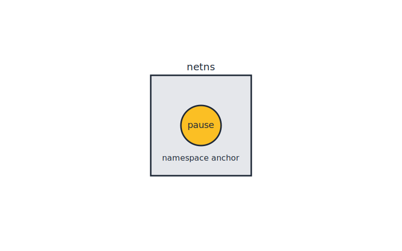

# Lab 02 – Lease Holder (Pause Container)
## City Component
Lease Holder (Pause Container)
## Purpose
This lab focuses on a single networking concept mapped to the city model.
Complete all steps sequentially.

## Visual

