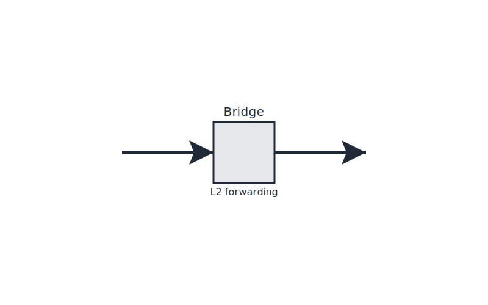

# Lab 04 – Hallway (Linux Bridge)
## City Component
Hallway (Linux Bridge)
## Purpose
This lab focuses on a single networking concept mapped to the city model.
Complete all steps sequentially.

## Visual

