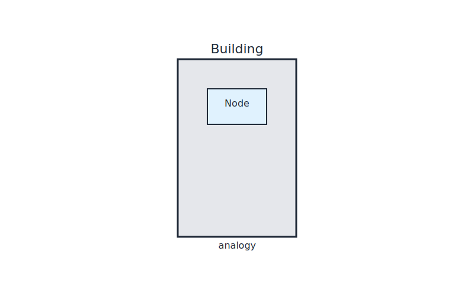
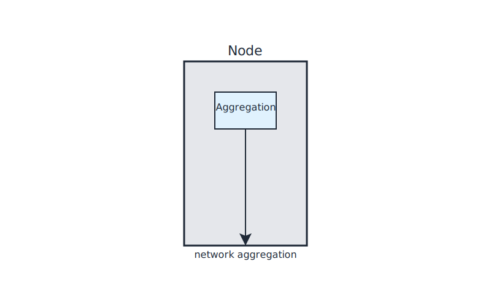

# Lab 05 – Building (Node)
## City Component
Building (Node)
## Purpose
This lab focuses on a single networking concept mapped to the city model.
Complete all steps sequentially.

## Visual

---
## Scenario Description
In this lab, the "Building" represents a node in the city analogy. Multiple apartments (network namespaces) are aggregated within a single building (node), all connected to a common bridge (br-hallway). This setup demonstrates how nodes aggregate pods and provide Layer 2 connectivity in Kubernetes networking.

## Steps
See [steps.md](./steps.md) for detailed instructions.

## Objectives
See [objectives.md](./objectives.md) for learning goals.

## Verification
See [verification.md](./verification.md) for how to confirm the lab outcome.

## Cleanup
See [cleanup.md](./cleanup.md) for environment restoration.
