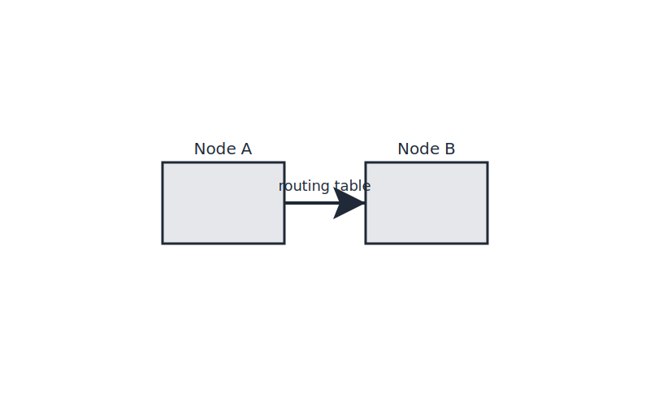
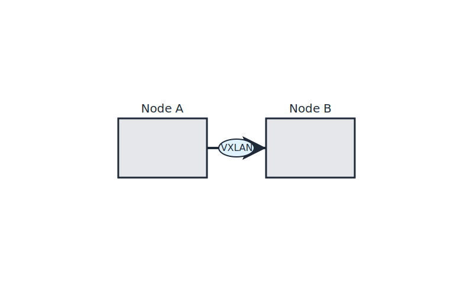

# Lab 06 – Roads (Routing & Overlay)
## City Component
Roads (Routing & Overlay)
## Purpose
This lab focuses on a single networking concept mapped to the city model.
Complete all steps sequentially.

## Visual

---
## Scenario Description
In this lab, "Roads" represent the routing and overlay networks that connect different buildings (nodes) in the city analogy. You will simulate inter-node communication using routing tables and optionally VXLAN overlays, demonstrating how Kubernetes maintains flat pod addressing across nodes.

## Steps
See [steps.md](./steps.md) for detailed instructions.

## Objectives
See [objectives.md](./objectives.md) for learning goals.

## Verification
See [verification.md](./verification.md) for how to confirm the lab outcome.

## Cleanup
See [cleanup.md](./cleanup.md) for environment restoration.
