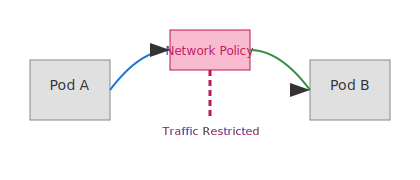

# Lab 09 – Security (Network Policies)
## City Component
Security (Network Policies)
## Purpose
This lab focuses on a single networking concept mapped to the city model.
Complete all steps sequentially.

## Visual

---
## Scenario Description
In this lab, "Security" represents network policies in Kubernetes. You will use iptables to enforce isolation between apartments (namespaces), demonstrating how network policies restrict traffic and provide security boundaries, just as city rules restrict movement between districts.

## Steps
See [steps.md](./steps.md) for detailed instructions.

## Objectives
See [objectives.md](./objectives.md) for learning goals.

## Verification
See [verification.md](./verification.md) for how to confirm the lab outcome.

## Cleanup
See [cleanup.md](./cleanup.md) for environment restoration.
